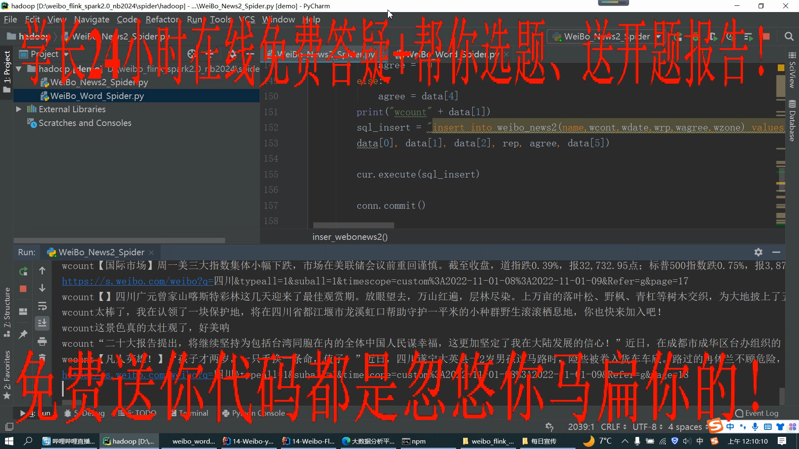
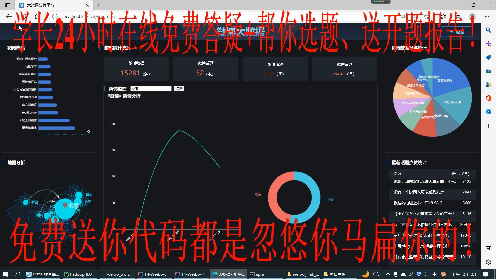
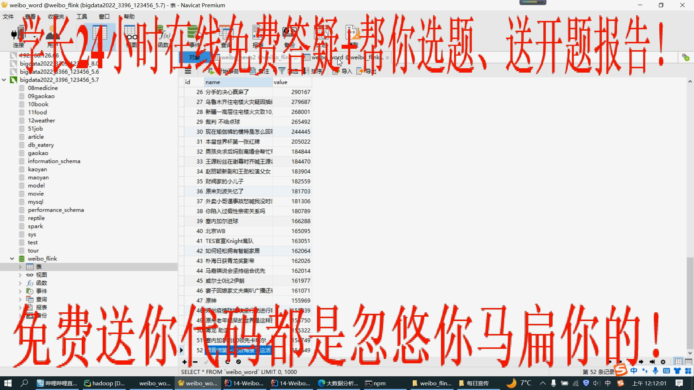
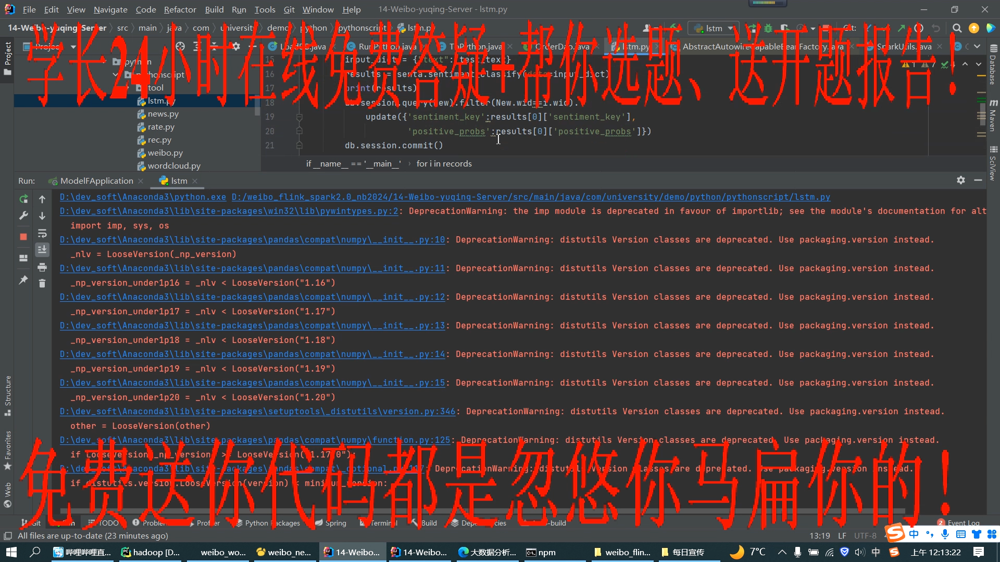
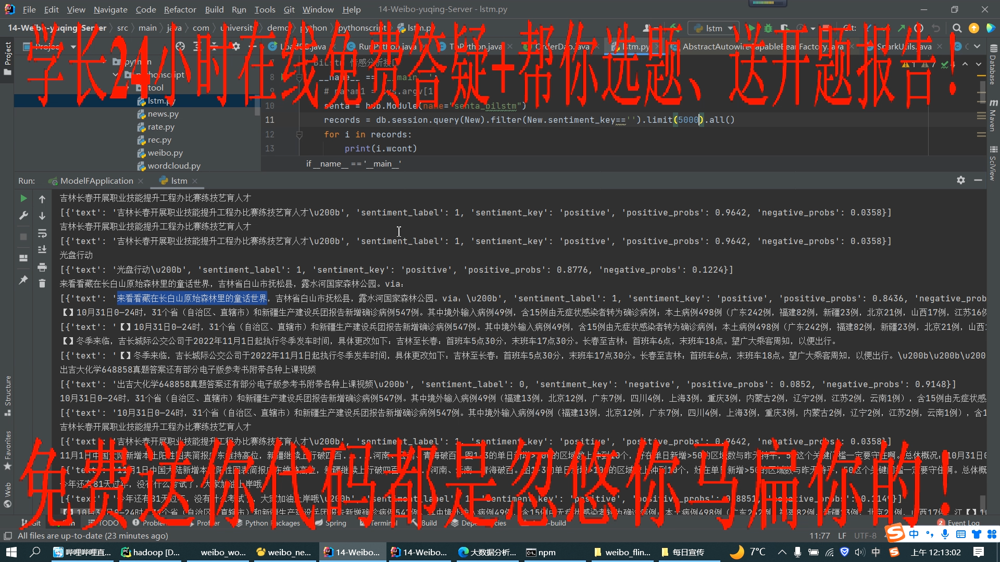
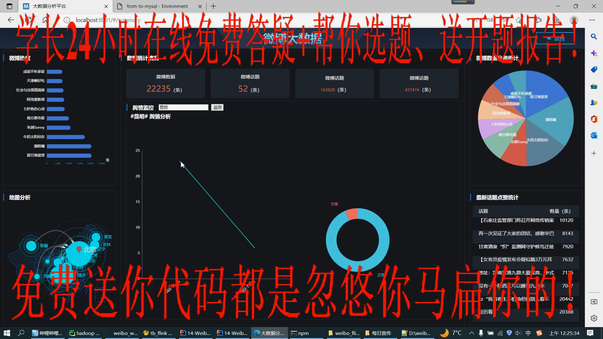
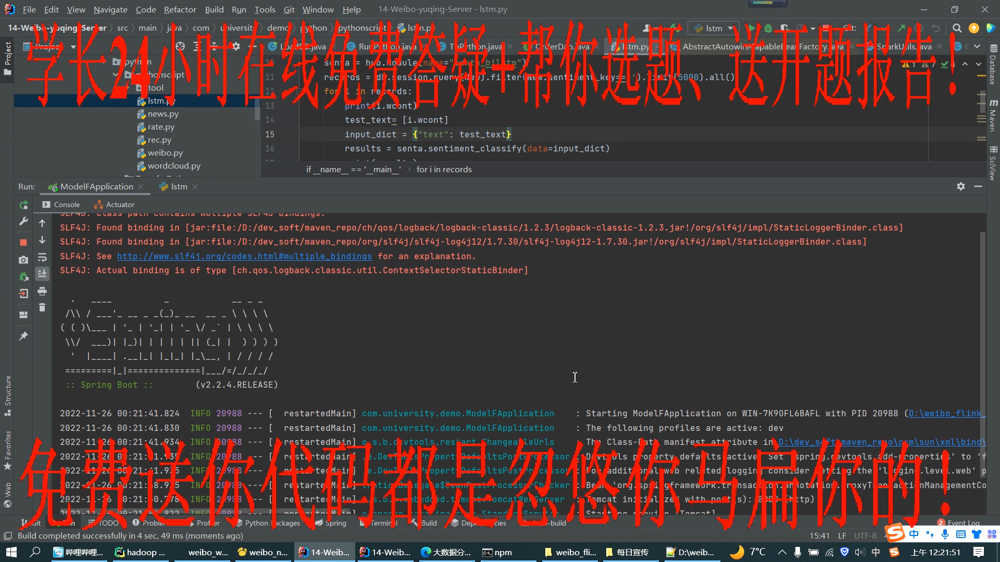
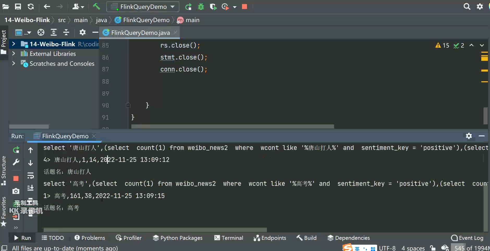

# 计算机毕业设计吊炸天Python+Spark+Hadoop+Flink微博舆情预警系统 微博舆情可视化 舆情大数据 微博大数据 微博爬虫 大数据毕业设计 大数据毕设

## 要求
### 源码有偿一套(论文 PPT 源码+sql脚本+虚拟机)
### 
### 加好友前帮忙start一下，并备注github有偿获取源码
### 我的QQ号是2877135669 

### 或者 微信 bysj2023nb

### 加qq好友说明（被部分  网友整得心力交瘁）：
    1.加好友务必按照格式备注git虚拟机电影推荐
    2.避免浪费各自的时间

# 多说几句：

2022年12月增加Spark大屏统计驾驶舱、Web后台管理系统
当前爬虫+三种机器学习推荐算法+用户画像可视化+虚拟机集群足够毕设了
但是更加吊炸天碾压导师绞杀导师让他无话答辩从头秒到尾的版本可说需要等到2022年12月这个版本

## 开发技术
前端：vue.js echarts websocket

后端：springboot+mybaits

大数据计算框架：spark flink

机器学习/深度学习：lstm情感分析

爬虫：Python爬虫

数据库：mysql

## 创新点

可视化大屏echarts

深度学习LSTM情感分析

Spark Flink大数据实时计算

Python_爬虫爬取百万百亿数据量

## 补充说明
适合大数据毕业设计、数据分析、爬虫类计算机毕业设计

# 运行截图

# 演示视频

https://www.bilibili.com/video/BV1xd4y1x7Hq/?spm_id_from=333.999.0.0
